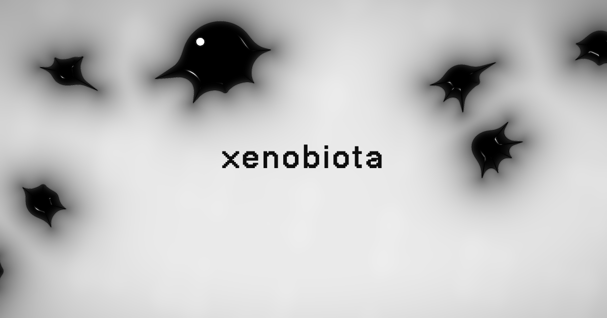

# Xenobiota

> We don't know what it is.



A single-file WebGL toy: a colony of alien black goo that crawls on tendril-limbs,
stalks your cursor, coalesces and scatters. Rendered as a metaball SDF in one
fragment shader.

**Live:** https://xenobiota.vercel.app

## Run it

It's one static `index.html` — no build step. Serve the folder with anything:

```bash
python3 -m http.server 8000
# then open http://localhost:8000
```

(Use a server rather than opening the file directly so the fonts and `og.png` load.)

## Interact

- **Move the cursor** — nearby critters wake and stalk it, creeping then darting in.
- **Click / poke** — squishes a critter.
- **Drag** — grab the nearest critter; it grips the floor and stretches.
- **Drag far** — it tears in half: the held half balls up under your cursor while
  the other half bolts away in fright. Release slow to drop, fast to throw.

The colony enters from the screen edges and converges on the center when the
scene opens, then wanders, merges, and splits on its own.

## How it works

Everything lives in `index.html`:

- **Rendering** — a full-screen triangle runs a fragment shader that evaluates a
  signed-distance field of metaball droplets blended with capsule "limbs"
  (`smin` soft-union), then shades a glossy black shell with rim light and specular highlights.
- **Simulation** — JS on the CPU steps each critter: octopus-style limb gait for
  locomotion, head steering (chase / wander / flee), wall avoidance, and
  volume-based merge/split. Droplet and limb segment data is uploaded to the
  shader as uniforms each frame.

Tunable constants (shape, locomotion, interaction, stalking, fright) are grouped
at the top of the script.

## Credits

By [tol.is](https://tol.is). Typeface: NeueBit.
